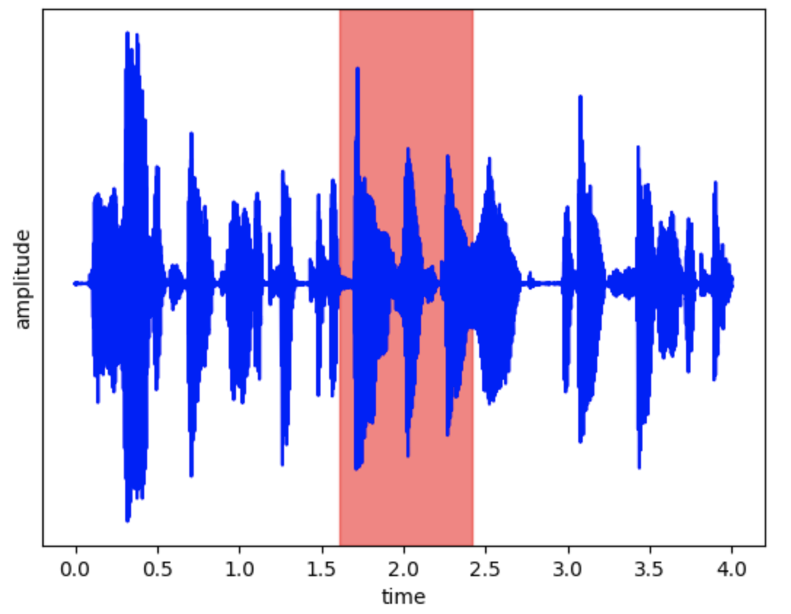

<div align="center"> <h1>️ Explainability model for audio deepfake detection 🔍 </h1> </div>

<div align="center">
    
    
    
    
    
    
    
</div>

### Intro

Designed to work with the [Rawnet2 baseline system](https://github.com/asvspoof-challenge/2021/tree/main/DF/Baseline-RawNet2)
from the ASVspoof challenge 2021. It is a black-box model that classifies audio 
clips as real or fake - where *fake* refers to a deepfake. This is an application
specific solution, splitting the audio clips into
5 time windows. Each window's Shapley value is evaluated, and my solution
highlights the segment of audio on the waveform plot with the largest positive
Shapley value. Therefore it displays to the user the segment of the audio that has the
largest effect on the classifier's decision. Note that this solution only works for
audio clips of ~ 4 secs. Further work would include generalising this explainability
model to work with all audio clips in the data set.

To use this model you must have a pre-trained Rawnet2 model *trained_model.pth*

The test set is an even split of bona fide and spoofed audio. It is
standardised to the `low_mp3` codec and contains 3 vocoders:
- `traditional_vocoder`
- `waveform_concatenation`
- `neural_vocoder_autoregressive`

To find out more about the properties of the test set take a look at
*trial_metadata.txt* from the [keys and metalabels](https://www.asvspoof.org/asvspoof2021/DF-keys-full.tar.gz)
package. Make sure to add *score.txt* and *trial_metadata.txt* to the directory.

### Example
In the example instance shown below, RawNet2 predicted that the audio is deepfaked, and my explainability model indicates that the middle time window is the most significant to the classifier's decision.
Therefore, the user should pay close attention to the middle of the audio clip, and determine whether they hear
any suspicious artefacts themselves.

<div align="center">
    
</div>

### Deployment
```
$ python3.6 -m venv .explainer
$ source .explainer/bin/activate
$ pip install -r requirements.txt
$ python explainer.py trained_model.pth
```
